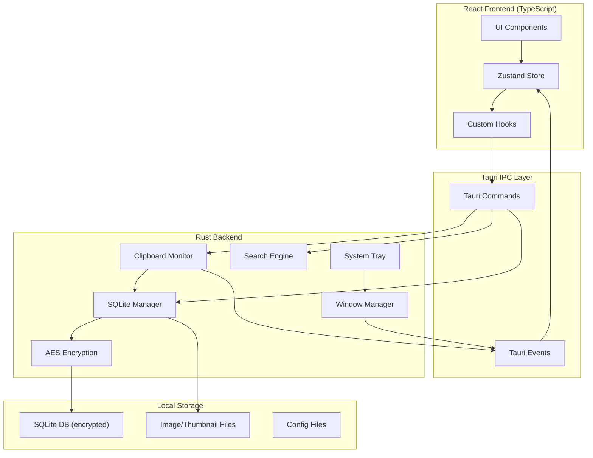

# OmniClip - 技术架构文档

## 1. 系统架构总览

### 1.1 架构模式
采用 Tauri v2 的前后端分离架构：
- **前端 (Frontend)**: React SPA 负责 UI 渲染和用户交互
- **后端 (Backend)**: Rust 负责系统级操作（剪贴板监听、数据库、搜索索引）
- **IPC 通信**: Tauri Command 进行前后端异步通信

### 1.2 架构图



## 2. 目录结构

```
OmniClip/
├── src/                          # React 前端源码
│   ├── components/               # UI 组件
│   │   ├── main/                 # 主窗口组件
│   │   │   ├── Sidebar.tsx       # 侧边栏
│   │   │   ├── SearchBar.tsx     # 搜索栏
│   │   │   ├── RecordList.tsx    # 记录列表
│   │   │   ├── RecordCard.tsx    # 记录卡片
│   │   │   └── TagManager.tsx    # 标签管理
│   │   ├── floating/             # 悬浮窗组件
│   │   │   ├── FloatingWindow.tsx
│   │   │   └── FloatingItem.tsx
│   │   ├── settings/             # 设置面板组件
│   │   │   ├── SettingsPanel.tsx
│   │   │   ├── ShortcutConfig.tsx
│   │   │   └── DataManagement.tsx
│   │   └── common/               # 通用组件
│   │       ├── GlassCard.tsx     # 毛玻璃卡片
│   │       ├── Tag.tsx           # 标签组件
│   │       └── Modal.tsx         # 模态框
│   ├── hooks/                    # 自定义 Hooks
│   │   ├── useClipboard.ts       # 剪贴板操作
│   │   ├── useSearch.ts          # 搜索逻辑
│   │   └── useSettings.ts        # 设置管理
│   ├── store/                    # Zustand 状态管理
│   │   ├── clipboardStore.ts     # 剪贴板状态
│   │   ├── searchStore.ts        # 搜索状态
│   │   └── settingsStore.ts      # 设置状态
│   ├── types/                    # TypeScript 类型定义
│   │   └── index.ts
│   ├── utils/                    # 工具函数
│   │   └── format.ts
│   ├── App.tsx                   # 应用根组件
│   └── main.tsx                  # 应用入口
├── src-tauri/                    # Tauri Rust 后端
│   ├── src/
│   │   ├── main.rs               # Rust 入口
│   │   ├── lib.rs                # 库入口 + Commands
│   │   ├── clipboard/
│   │   │   ├── mod.rs            # 剪贴板模块
│   │   │   ├── monitor.rs        # 监听逻辑
│   │   │   └── types.rs          # 类型定义
│   │   ├── database/
│   │   │   ├── mod.rs            # 数据库模块
│   │   │   ├── manager.rs        # SQLite 管理
│   │   │   ├── models.rs         # 数据模型
│   │   │   └── migrations.rs     # 数据库迁移
│   │   ├── search/
│   │   │   ├── mod.rs            # 搜索模块
│   │   │   ├── indexer.rs        # 倒排索引
│   │   │   └── engine.rs         # 搜索引擎
│   │   ├── encryption/
│   │   │   ├── mod.rs            # 加密模块
│   │   │   └── aes.rs            # AES 实现
│   │   ├── tray/
│   │   │   ├── mod.rs            # 托盘模块
│   │   │   └── menu.rs           # 托盘菜单
│   │   └── config/
│   │       ├── mod.rs            # 配置模块
│   │       └── settings.rs       # 设置管理
│   ├── Cargo.toml
│   ├── tauri.conf.json           # Tauri 配置
│   ├── build.rs
│   └── icons/                    # 应用图标
├── package.json
├── vite.config.ts
├── tailwind.config.ts
├── tsconfig.json
└── .gitignore
```

## 3. 核心模块设计

### 3.1 剪贴板监听模块 (Rust)

#### 实现方案
```rust
// 使用 arboard crate 进行跨平台剪贴板操作
// 采用事件驱动 + 轮询降级策略

pub struct ClipboardMonitor {
    clipboard: Clipboard,
    last_hash: String,
    app_handle: AppHandle,
    is_running: AtomicBool,
}

impl ClipboardMonitor {
    pub fn start(&mut self) {
        // 优先使用 OS 事件钩子 (Windows: Clipboard Viewer Chain)
        // macOS: NSPasteboardChangeCount
        // Linux: X11 Selection / Wayland protocols
        
        // 降级方案：500ms 轮询
        tokio::spawn(async move {
            let mut interval = tokio::time::interval(Duration::from_millis(500));
            loop {
                interval.tick().await;
                self.poll_clipboard().await;
            }
        });
    }
}
```

#### 数据类型处理
| 类型 | 处理方式 |
|------|----------|
| 文本 | 直接存储，截断预览前 200 字符 |
| 图片 | 保存为 PNG 到本地，数据库存路径 + 生成缩略图 |
| 文件 | 提取文件路径列表，JSON 序列化存储 |

### 3.2 数据库模块 (Rust + SQLite)

#### 数据库连接
```rust
// 使用 sqlx 进行异步 SQLite 操作
pub struct DatabaseManager {
    pool: SqlitePool,
    encryption_key: Vec<u8>,
}
```

#### 表结构

**clipboard_records 表**
```sql
CREATE TABLE clipboard_records (
    id TEXT PRIMARY KEY,              -- UUID
    record_type TEXT NOT NULL,        -- 'text', 'image', 'files'
    content_hash TEXT NOT NULL,       -- SHA256 用于去重
    content TEXT,                     -- 加密后的内容
    thumbnail_path TEXT,              -- 缩略图路径
    title TEXT NOT NULL,              -- 预览标题
    is_starred INTEGER DEFAULT 0,     -- 是否星标
    copy_count INTEGER DEFAULT 1,     -- 使用次数
    source_app TEXT,                  -- 来源应用
    created_at TEXT NOT NULL,         -- ISO8601
    updated_at TEXT NOT NULL          -- ISO8601
);

CREATE INDEX idx_hash ON clipboard_records(content_hash);
CREATE INDEX idx_starred ON clipboard_records(is_starred);
CREATE INDEX idx_created ON clipboard_records(created_at DESC);
```

**record_tags 关联表**
```sql
CREATE TABLE record_tags (
    record_id TEXT REFERENCES clipboard_records(id),
    tag_id TEXT REFERENCES tags(id),
    PRIMARY KEY (record_id, tag_id)
);
```

**tags 表**
```sql
CREATE TABLE tags (
    id TEXT PRIMARY KEY,
    name TEXT UNIQUE NOT NULL,
    color TEXT NOT NULL,              -- HEX 颜色
    created_at TEXT NOT NULL
);
```

**settings 表**
```sql
CREATE TABLE settings (
    key TEXT PRIMARY KEY,
    value TEXT NOT NULL
);
```

#### FTS5 全文搜索
```sql
-- 使用 SQLite FTS5 虚拟表进行全文搜索
CREATE VIRTUAL TABLE clipboard_fts USING fts5(
    content,
    content='clipboard_records',
    content_rowid='rowid',
    tokenize='unicode61'
);

-- 触发器同步
CREATE TRIGGER records_ai AFTER INSERT ON clipboard_records BEGIN
    INSERT INTO clipboard_fts(rowid, content) 
    VALUES (new.rowid, new.content);
END;
```

### 3.3 搜索模块 (Rust)

#### 搜索引擎设计
```rust
pub struct SearchEngine {
    fts_enabled: bool,
    // 可选：tantivy 内存索引用于更高级的模糊匹配
    tantivy_index: Option<Index>,
}

impl SearchEngine {
    pub async fn search(&self, query: &str, filters: SearchFilters) -> Vec<Record> {
        // 1. 拼音转换（中文 -> pinyin）
        // 2. FTS5 查询
        // 3. 结果排序（相关性 + 时间加权）
        // 4. 返回 Top N
    }
}
```

#### 拼音处理
```rust
// 使用 rust-pinyin crate
fn text_to_pinyin(text: &str) -> String {
    // 中文转拼音，支持首字母搜索
    // "你好" -> "ni hao" -> "nh"
}
```

### 3.4 加密模块 (Rust)

#### AES-GCM 加密
```rust
use aes_gcm::{Aes256Gcm, KeyInit, Nonce};
use rand::rngs::OsRng;

pub struct EncryptionManager {
    cipher: Aes256Gcm,
}

impl EncryptionManager {
    pub fn encrypt(&self, plaintext: &[u8]) -> Vec<u8> {
        // 生成随机 nonce
        // AES-256-GCM 加密
        // 返回 nonce + ciphertext
    }
    
    pub fn decrypt(&self, encrypted: &[u8]) -> Result<Vec<u8>> {
        // 提取 nonce
        // AES-256-GCM 解密
    }
}
```

#### 密钥管理
- 首次启动生成主密钥，使用操作系统密钥链存储
- Windows: Windows Credential Manager
- macOS: Keychain
- Linux: Secret Service API (libsecret)

### 3.5 前端状态管理 (Zustand)

```typescript
// store/clipboardStore.ts
interface ClipboardState {
  records: ClipboardRecord[];
  selectedRecord: ClipboardRecord | null;
  isLoading: boolean;
  pagination: PaginationState;
  
  // Actions
  fetchRecords: (filters: RecordFilters) => Promise<void>;
  selectRecord: (record: ClipboardRecord) => void;
  toggleStar: (id: string) => Promise<void>;
  addTags: (id: string, tags: string[]) => Promise<void>;
  deleteRecord: (id: string) => Promise<void>;
}

// store/searchStore.ts
interface SearchState {
  query: string;
  results: ClipboardRecord[];
  isSearching: boolean;
  filters: SearchFilters;
  
  // Actions
  setQuery: (q: string) => void;
  executeSearch: () => Promise<void>;
  setFilters: (f: SearchFilters) => void;
}
```

### 3.6 Tauri Commands

```rust
// 剪贴板相关
#[tauri::command]
async fn get_clipboard_records(limit: usize, offset: usize) -> Result<Vec<Record>>;

#[tauri::command]
async fn toggle_star_record(id: String) -> Result<bool>;

#[tauri::command]
async fn delete_record(id: String) -> Result<()>;

// 搜索
#[tauri::command]
async fn search_records(query: String, filters: SearchFilters) -> Result<Vec<Record>>;

// 标签
#[tauri::command]
async fn create_tag(name: String, color: String) -> Result<Tag>;

#[tauri::command]
async fn add_tags_to_record(record_id: String, tag_ids: Vec<String>) -> Result<()>;

// 设置
#[tauri::command]
async fn get_settings() -> Result<Settings>;

#[tauri::command]
async fn update_settings(settings: SettingsUpdate) -> Result<()>;

// 悬浮窗
#[tauri::command]
async fn show_floating_window() -> Result<()>;

#[tauri::command]
async fn paste_record(id: String) -> Result<()>;
```

## 4. 窗口管理

### 4.1 窗口配置

**主窗口**
```json
{
  "label": "main",
  "title": "OmniClip",
  "width": 900,
  "height": 650,
  "resizable": true,
  "transparent": false
}
```

**悬浮窗**
```json
{
  "label": "floating",
  "title": "OmniClip",
  "width": 380,
  "height": 500,
  "resizable": false,
  "transparent": true,
  "decorations": false,
  "alwaysOnTop": true,
  "skipTaskbar": true,
  "focus": true
}
```

### 4.2 悬浮窗交互逻辑
```typescript
// 悬浮窗失焦自动隐藏
useEffect(() => {
  const handleClickOutside = (e: MouseEvent) => {
    if (!floatingWindowRef.current?.contains(e.target as Node)) {
      hideFloatingWindow();
    }
  };
  
  document.addEventListener('mousedown', handleClickOutside);
  return () => document.removeEventListener('mousedown', handleClickOutside);
}, []);

// 键盘导航
const handleKeyDown = (e: KeyboardEvent) => {
  switch (e.key) {
    case 'ArrowDown': setSelectedIndex(prev => prev + 1);
    case 'ArrowUp': setSelectedIndex(prev => prev - 1);
    case 'Enter': pasteSelected();
    case 'Escape': hideFloatingWindow();
  }
};
```

## 5. 全局快捷键

```rust
// 使用 tauri-plugin-global-shortcut
fn setup_global_shortcuts(app: &AppHandle) {
    let shortcut = get_saved_shortcut(app); // 从配置读取
    
    app.global_shortcut_manager()
        .register(&shortcut, move |_app, _shortcut| {
            // 切换悬浮窗显示/隐藏
            toggle_floating_window(app);
        })
        .expect("Failed to register global shortcut");
}
```

## 6. 系统托盘

```rust
// 使用 tauri-plugin-tray
fn setup_system_tray(app: &AppHandle) -> SystemTray {
    SystemTray::new()
        .with_menu(SystemTrayMenu::new()
            .add_item(CustomMenuItem::new("open", "打开主窗口"))
            .add_item(CustomMenuItem::new("toggle_monitor", "暂停记录"))
            .add_native_item(SystemTrayMenuItem::Separator)
            .add_item(CustomMenuItem::new("quick_search", "快速搜索"))
            .add_native_item(SystemTrayMenuItem::Separator)
            .add_item(CustomMenuItem::new("quit", "退出"))
        )
        .on_event(|app, event| match event {
            SystemTrayEvent::MenuItemClick { id, .. } => {
                handle_tray_action(app, &id);
            }
            _ => {}
        })
}
```

## 7. 安全设计

### 7.1 零网络请求保证
- Cargo.toml 不包含任何网络相关 crate
- Tauri 配置禁用所有网络能力
- Content Security Policy 严格限制

### 7.2 数据加密流程
```
[剪贴板内容] 
    ↓
[SHA256 去重检查]
    ↓
[AES-256-GCM 加密]
    ↓
[SQLite 存储]
```

### 7.3 密钥派生
```rust
// 使用 PBKDF2 从用户密码派生密钥
use pbkdf2::pbkdf2_hmac;
use sha2::Sha256;

fn derive_key(password: &str, salt: &[u8]) -> [u8; 32] {
    let mut key = [0u8; 32];
    pbkdf2_hmac::<Sha256>(
        password.as_bytes(),
        salt,
        100_000,  // iterations
        &mut key,
    );
    key
}
```

## 8. 性能优化策略

### 8.1 图片处理
- 生成缩略图 (max 200x200) 用于列表展示
- 原图按需加载
- 自动清理未引用的图片文件

### 8.2 搜索优化
- FTS5 虚拟表加速全文搜索
- 增量索引更新
- 搜索结果缓存

### 8.3 内存管理
- 历史记录懒加载（分页）
- 图片缩略图懒加载
- 定时清理已释放的内存索引

## 9. 打包部署

### 9.1 Tauri 配置
```json
{
  "bundle": {
    "active": true,
    "targets": "all",
    "icon": [
      "icons/32x32.png",
      "icons/128x128.png",
      "icons/128x128@2x.png",
      "icons/icon.icns",
      "icons/icon.ico"
    ],
    "windows": {
      "certificateThumbprint": null,
      "digestAlgorithm": "sha256",
      "timestampUrl": ""
    }
  }
}
```

### 9.2 构建命令
```bash
# 开发
npm run tauri dev

# 生产构建
npm run tauri build

# 输出
# Windows: src-tauri/target/release/bundle/msi/OmniClip_x64_en-US.msi
# macOS: src-tauri/target/release/bundle/dmg/OmniClip_x64.dmg
# Linux: src-tauri/target/release/bundle/appimage/OmniClip_x86_64.AppImage
```

## 10. 测试策略

### 10.1 Rust 单元测试
```rust
#[cfg(test)]
mod tests {
    use super::*;
    
    #[test]
    fn test_encrypt_decrypt() {
        // 验证加解密往返
    }
    
    #[test]
    fn test_search_engine() {
        // 验证搜索准确性
    }
}
```

### 10.2 前端测试
- Vitest 单元测试
- React Testing Library 组件测试
- Playwright E2E 测试（可选）

## 11. 关键依赖清单

### Rust (Cargo.toml)
```toml
[dependencies]
tauri = { version = "2", features = ["tray-icon", "global-shortcut"] }
tauri-plugin-sql = { version = "2", features = ["sqlite"] }
tauri-plugin-global-shortcut = "2"
tauri-plugin-tray = "2"
arboard = "3"           # 跨平台剪贴板
sqlx = { version = "0.7", features = ["runtime-tokio", "sqlite"] }
aes-gcm = "0.10"        # AES 加密
rand = "0.8"            # 随机数
serde = { version = "1", features = ["derive"] }
serde_json = "1"
tokio = { version = "1", features = ["full"] }
sha2 = "0.10"           # SHA256
pbkdf2 = "0.12"         # 密钥派生
rust-pinyin = "0.10"    # 中文拼音
uuid = { version = "1", features = ["v4"] }
chrono = { version = "0.4", features = ["serde"] }
```

### TypeScript (package.json)
```json
{
  "dependencies": {
    "@tauri-apps/api": "^2",
    "@tauri-apps/plugin-shell": "^2",
    "react": "^18",
    "react-dom": "^18",
    "zustand": "^4.5"
  },
  "devDependencies": {
    "@types/react": "^18",
    "@types/react-dom": "^18",
    "@vitejs/plugin-react": "^4",
    "autoprefixer": "^10",
    "postcss": "^8",
    "tailwindcss": "^3.4",
    "typescript": "^5",
    "vite": "^5"
  }
}
```
